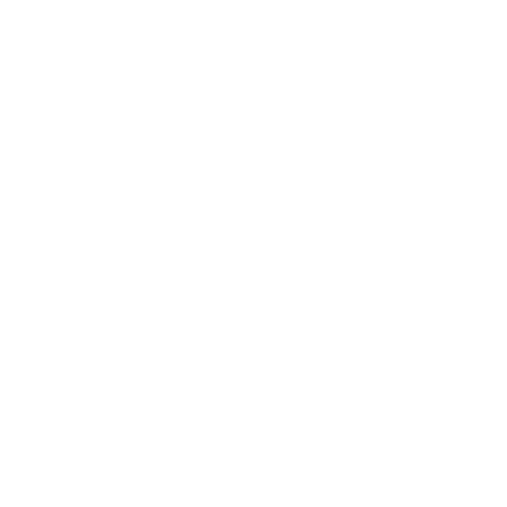
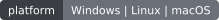
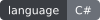
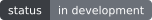

<div align="center">
  <picture>
    <source media="(prefers-color-scheme: dark)" srcset="assets/rigspec-kit-svg-logo-stacked-mono-white.svg">
    <source media="(prefers-color-scheme: light)" srcset="assets/rigspec-kit-svg-logo-stacked-mono-black.svg">
    
  </picture>
  
  <p align="center">
    
    
    
    
    
  </p>
  
  <p align="center">
    <a href="https://github.com/Terminay/rigspec/releases"></a>
    <a href="https://github.com/Terminay/rigspec/blob/main/LICENSE"></a>
    <a href="https://github.com/Terminay/rigspec/actions"></a>
    <a href="https://github.com/Terminay/rigspec/stargazers"></a>
  </p>
</div>

A local-first, cross-platform hardware inspection tool for Windows, macOS, and Linux.

rigspec is a C# / .NET / Avalonia desktop application. The GUI and CLI share the same hardware service layer. Hardware detection does not require Python, network access, or telemetry.

## What it reports

Operating system, CPU, memory, motherboard, BIOS, GPU, storage, network adapters, and displays. Fields the OS does not expose are marked unavailable rather than guessed.

## Build

Requires the .NET 10 SDK. From the repository root:

```sh
dotnet build RigSpec.slnx
dotnet test RigSpec.slnx
```

GUI:

```sh
dotnet run --project src/RigSpec.App
```

CLI (same data as the GUI):

```sh
dotnet run --project src/RigSpec.Cli
dotnet run --project src/RigSpec.Cli -- --json
dotnet run --project src/RigSpec.Cli -- --diagnostics
```

Create self-contained builds:

```sh
dotnet publish src/RigSpec.App/RigSpec.App.csproj -c Release -r win-x64 --self-contained true
dotnet publish src/RigSpec.Cli/RigSpec.Cli.csproj -c Release -r linux-x64 --self-contained true
```

## Continuous integration

GitHub Actions runs the build and test suite on Windows, macOS, and Linux for every push and pull request. After those checks pass, it publishes self-contained GUI and CLI builds for Windows x64, Linux x64, and macOS x64 as workflow-run artifacts.

To check the same steps locally, install the .NET 10 SDK and run:

```sh
dotnet restore RigSpec.slnx
dotnet build RigSpec.slnx -c Release --no-restore
dotnet test RigSpec.slnx -c Release --no-build --verbosity normal
```

To test the hosted workflow, push a branch and open a pull request, then check the **Actions** tab for the `ci` workflow. Once it succeeds, open the run to download its `rigspec-win-x64`, `rigspec-linux-x64`, and `rigspec-osx-x64` artifacts. These are temporary workflow artifacts, not committed binaries or a published GitHub Release.

## Architecture

See [docs/ARCHITECTURE.md](docs/ARCHITECTURE.md).

## Contributing and security

See [CONTRIBUTING.md](CONTRIBUTING.md), [CODE_OF_CONDUCT.md](CODE_OF_CONDUCT.md), and [SECURITY.md](SECURITY.md). Use the issue forms for bug reports and feature requests.

## Privacy

rigspec runs entirely on the local machine. Hardware detection does not upload data and does not require a network connection.

## License

See `LICENSE`.
